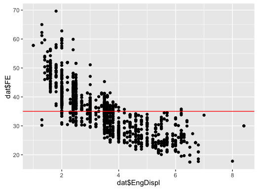
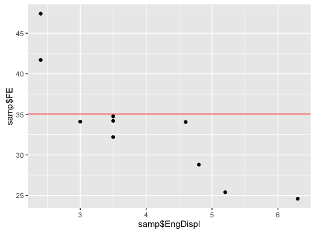
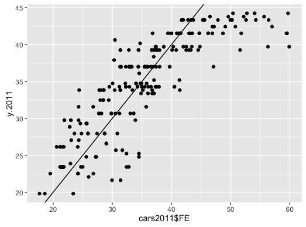
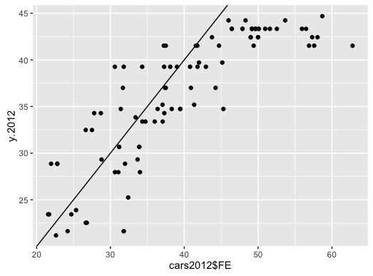

This exercise uses the **Fuel Economy** data set from the **AppliedPredicitiveModeling** package.

Note: The following will set-up your environment for this exercise. If you get an error stating that the packages have not been found, you need to install those packages.


```{r,echo=FALSE}

packs <-  c('AppliedPredictiveModeling', 'ggplot2', 'magrittr', 'dplyr')

for( nm in packs ) { 
  # message(nm)
  if( ! nm  %in% installed.packages()[,1]  ) install.packages(nm)
  library(nm, character.only = TRUE)
}

# Load data set into environment
data(FuelEconomy)
... = NULL  # Needed for aesthetics 

```


## Exercise 1

Hint: See `?cars2010`


- After the **Fuel Economy** data is loaded, combine three data sets into one data set. (Note: The name `dat` is very often used in these situations, `data` is a reserved R word.)  

```{r}
dat<-bind_rows(cars2010,cars2011,cars2012)
```

- What is a good "naive guess" of FE? Show your work

```{r}
naive_guess <- mean(dat$FE) # 35.03823
```

- plot FE (Fuel Econonomy) vs. EngDisp. Plot the naive guess.

```{r}
qplot(y=dat$FE,x=dat$EngDispl)+geom_hline(yintercept=naive_guess,color="red")
```



- Sample 10 observations from `dat`
- Plot this data. Add a line for the naive_guess. 

```{r}
set.seed(314) 
samp<-dat %>% sample_n(10)
qplot(y=samp$FE,x=samp$EngDispl)+geom_hline(yintercept=naive_guess,color="red") 
```



## Exercise 2:


Write a loss functions for calculating:
- Root Mean Square Error
- Mean Absolute Error
- Median Absolute Error

All functions should accept two arguments: 


```{r}

rmse <- function(y,yhat) {
( y - yhat )^2  %>% mean   %>% sqrt 
}
```

```{r}
mae <- function(y, yhat){
( y - yhat )  %>% abs   %>% mean 
}
```

```{r}
medae <- function(y, yhat) { 
( y - yhat )  %>% abs   %>% median
}
```


Use these functions to evaluate the loss/performance of:
- the naive guess (on dat - 3 car datasets)
```{r}
rmse(dat$FE,naive_guess) # 8.096176
mae(dat$FE,naive_guess) # 6.319942
medae(dat$FE,naive_guess) # 5.238326
```
- the naive guess (on the 10 randomly sampled cars)
```{r}
rmse(samp$FE,naive_guess) # 8.662936
mae(samp$FE,naive_guess) # 6.197919
medae(samp$FE,naive_guess) # 2.5855
```

## Exercise 3: Linear Model and Model Performance 

- Use `lm` to create a linear model fitting the relationship between FE and EngDispl for the cars2010 data set


```{r}
fit.2010<-lm(FE~EngDispl,data=cars2010)
```

- Use your functions to evaluate the training error
```{r}
y.2010<-predict.lm(fit.2010,newdata=cars2010)
rmse.2010  <- rmse(cars2010$FE,y.2010) # 4.620076
mae.2010   <- mae(cars2010$FE,y.2010) # 3.511693
medae.2010 <- medae(cars2010$FE,y.2010) # 2.935792
```

- Use your model to:
-- predict the FE for 2011. What is the RMSE errors associated with the predictions.
-- predict the FE for 2012. What is the RMSE errors associated with the predictions.

```{r}
y.2011 <- predict.lm(fit.2010,newdata=cars2011)
y.2012 <- predict.lm(fit.2010,newdata=cars2012)

rmse.2011 <- rmse(cars2011$FE,y.2011) # 5.162531
rmse.2012 <- rmse(cars2012$FE,y.2012) # 6.63853

```





```{r}
# DO NOT EDIT 
rmse.2010 
rmse.2011
rmse.2012
```


## Exercise 4: 

- Model the fuel economy (`FE`) as a function of `EngDispl`, `NumCyl` and `VarValve` using the `cars2011` data set.  
- Provide betas


```{r}
fit.2010 <- ...
betas <- ...
```
