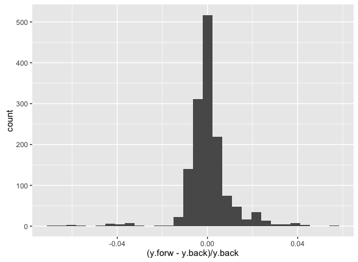
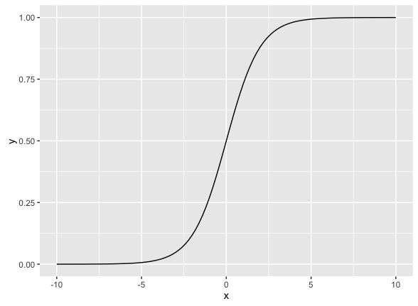
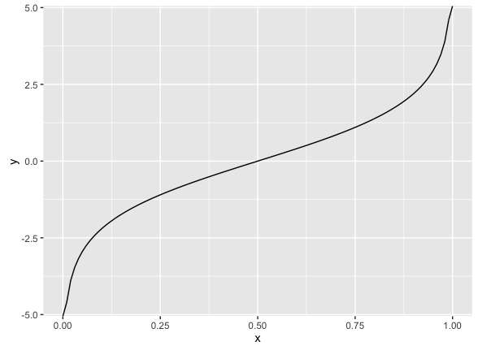

## Readings

***APM***

- Chapter 4 "Over Fitting and Model Tuning"
- Chapter 12.2 "Logisitic Regression""


## Miscellaneous

I am still struggling with names ...

- Please send me your picture


## Assignment 

Note: The following will set-up your environment for this exercise. If you get an error stating that the packages have not been found, you need to install those packages.


```{r,echo=FALSE, warning=FALSE, message=FALSE}

packs <-  c('AppliedPredictiveModeling', 'ggplot2', 'magrittr', 'dplyr', 'caret','MASS')

for( nm in packs ) { 
  # message(nm)
  if( ! nm  %in% installed.packages()[,1]  ) install.packages(nm)
  library(nm, character.only = TRUE)
}

# Load data set into environment
data(FuelEconomy)     # See ?cars2010
fe <- dplyr::bind_rows(cars2010, cars2011, cars2012)    # Define Da


data("GermanCredit")  # see GermanCredit

... = NULL  # Needed for aesthetics 

```


## StepAIC


Using Fuel Economy data set from the **AppliedPredictiveModeling** Package.
- fit the simplest possible model using lm
- Use MASS::StepAIC to improve the model using forward stepwise regression
- Fit the "full" model using lm
- USe MASS::StepAIC to improve the model using backward stepwise regression 

```{r}
# Simplest model (intercept-only)
fit.simple<-lm(FE~1,fe)
# Define full linear model form
forms = FE ~ EngDispl + NumCyl + Transmission + FE + AirAspirationMethod + NumGears + TransLockup + TransCreeperGear + DriveDesc + IntakeValvePerCyl + ExhaustValvesPerCyl + CarlineClassDesc + VarValveTiming + VarValveLift
# Forward stepwise regression on simple model
fit.forward <- stepAIC(fit.simple, scope=forms, direction = "forward")
# Define full model
fit.full<-lm(FE~.,fe)
# Backward stepwise regression on full model
fit.backward <- stepAIC(fit.full, scope=forms, direction = "backward")
```

- Are they the same model? If not why?  Which is better?

The forward stepwise regression model starts with an AIC value of `6054.49` using just the intercept (mean), and then proceeds to add the following 9 variables in order: `EngDispl`, `CarlineClassDesc`, `DriveDesc`, `Transmission`, `NumCyl`, `IntakeValvePerCyl`, `VarValveLift`, `TransLockup`, `NumGears`.  The corresponding progression of the AIC value is: `4571.86`, `4179.04`, `3917.90`, `3798.87`, `3705.00`, `3683.26`, `3667.99`, `3664.51`, `3662.66`.

The forward regression model therefore does not use the following 4 variables, as they increase the AIC from this point slightly: `AirAspirationMethod` (`3663.1`), `TransCreeperGear` (`3663.5`), `VarValveTiming` (`3663.7`), `ExhaustValvesPerCyl` (`3664.0`).

Some measures of the forward regression fit performance:
```
Residual standard error: 3.495 on 1405 degrees of freedom
Multiple R-squared:  0.8191,	Adjusted R-squared:  0.8138 
F-statistic: 155.1 on 41 and 1405 DF,  p-value: < 2.2e-16
```

The backward stepwise regression starts with all 13 variables and an AIC value of `3665.22`.  The first variable to removed is `VarValveTiming` decreasing the AIC value to `3663.8`.  The next variable to be removed is `IntakeValvePerCyl`, decreasing the AIC value to `3663.23`. After this, removing any remaining of the remmaing variables increases AIC.

Some measures of the backward regression fit performance:
```
Residual standard error: 3.492 on 1402 degrees of freedom
Multiple R-squared:  0.8197,	Adjusted R-squared:  0.8141 
F-statistic: 144.9 on 44 and 1402 DF,  p-value: < 2.2e-16
```

The two models are not the same, namely forward uses 9 variables and backward uses 11 variables.  However, the final AIC values are very close (`3662.66` vs. `3663.23`), and the measures of fit performance are very similar.  A visual insepection of the coeffecients for the variables in common reveals they have very similar values.  Lastly, one can plot the fractional difference of the predictions between the two models.  The difference is typically less than 1% with a few outliers ranging up to 4-5%.  In summary, the two models are not identical, but very similar, and differ mainly due to small information content fluctuations in proceeding stepwise forward vs. backward from the simple versus full model.

```{r}
y.forw <- predict.lm(fit.forward,newdata=fe)
y.back <- predict.lm(fit.backward,newdata=fe)
qplot((y.forw-y.back)/y.back))
```



## Logsitic and Inverse Logistic Transformation 

- Write an R function for the logistic function. The function should accept a `numeric` vector with values `[-Inf,Inf]` and produce a numeric vector in the the range `[0,1]`.

- Plot the logistic function from  `[-10,10]`

- Write a R function for the inverse logistic function. The function should accept a `numeric` vector with values `[0,1]` and prodcuce a numeric vector in the range `[-Inf,Inf]`

- Plot the Inverse Logistic function from `[0,1]`


**Hint:** For plotting curves see `?graphics::curve` or `?ggplot2::stat_function`


```{r}

logistic <- function(x) { 
  1/(1+exp(-x))
}

ggplot(data.frame(x=c(-10, 10)), aes(x)) + stat_function(fun=logistic)

logistic_inv <- function(y) { 
  log(y/(1-y))
}

ggplot(data.frame(x=c(0, 1)), aes(x)) + stat_function(fun=logistic_inv)


```




**NOTE"** These functions are quite handy, in evaluating logistic regression results. You may want to save these functions in your own package.  

```{r}
# DO NOT EDIT
c(-Inf,0,Inf) %>% logistic

c(0,0.5,1) %>% logistic_inv

```


## German Credit Model

Using the GermanCredit data from the **Caret** package/ UCI Machine Learning Library, create a model for `Class` ("Good" vs. "Bad" ). Show your model performance.  

install.package("caret")"
library(caret)
data(GermanCreditData)
fit.glm<-glm(Class~ ., data=GermanCredit,family="binomial")
stepAIC(fit.glm,scope,direction )

```{r}
fit.glm<-glm(Class~ ., data=GermanCredit,family="binomial")
yfit<-predict.glm(fit.glm,newdata=GermanCredit,type="response")
qplot(x=GermanCredit$Class,y=yfit,geom="boxplot")
```

#form = Class ~ InstallmentRatePercentage + SavingsAccountBonds.lt.100 + CreditHistory.ThisBank.AllPaid +
#CheckingAccountStatus.lt.0 + CheckingAccountStatus.0.to.200

## Iterative Correlated Feature Removal 

- Implement Kuhn's iterative feature removal function described in **APM** Section 3.5, page 47


## Synthetic Data (Optional)

Sometimes it is useful to "synthesize" feature data for to understand how a certain model behaves. 
Sythesize the following features 1000-element vectors: 

- x1: a normally distributed variable with `mean = 20` and standard deviation = 20 (`sd=8`).
- x2: a log-normally distributed feature with `meanlog = 1`, `sdlog=1.2`
- x3: a uniformly distributed feature with `min=0` and `max=50`. 

```{r}
nsamples = 20

x1 <- rnorm(nsamples,20,20)  
x2 <- rlnorm(nsamples, meanlog=1, sdlog = 1.2)
x3 <- runif(nsamples,0,50)

```

Next synthesis a response, `y` using the betas provided and an intercept that is normally distributed at 20 with standard deviation of 2. (**Hint:**  The betas thought of can be a vector or matrix)


```{r}

beta0 <- rnorm(nsamples,0,15)  # intercept!
beta1 <- 2.3
beta2 <- 4
beta3 <- 7

betas <- matrix( c(2.5, 4, 7), nrow=1  )  # 1x4 matrix

# x0 <- rep(1,nsamples) 

X  <- cbind(x1,x2,x3)  # 1000x4

y <- betas %*% t(X) %>% t
y <- y + beta0

qplot(y)
dat <- data.frame(y,X)

fit <- lm( y ~ . , dat )

coef(fit)

fit
```

- Did you recover the betas? 
- Is the model good?
- What happens if increase the value of `nsamples`? Decrease it?
- What transformations would you apply to x1? x2? x3? 
