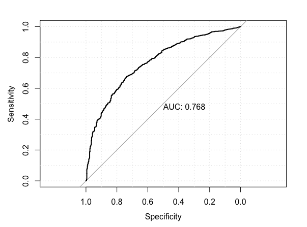
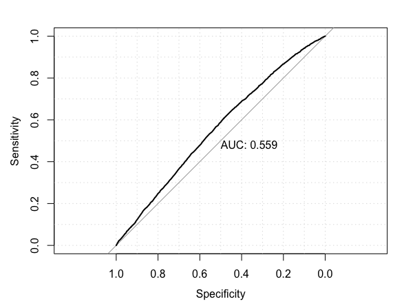
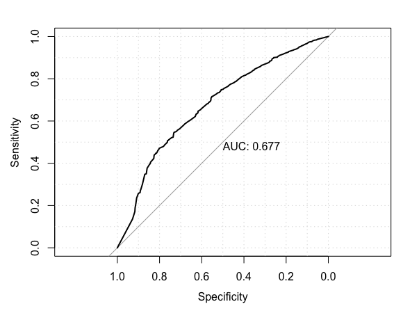

## Reading:
- **APM** Chapter 8.1-8.5 "Regression Trees and Rule-Based Models" (25 pages)
- **APM** Chapter 14.1-14.5 "Classification Trees and Rule-Based"

```{r, echo=FALSE, results='hide', warning=FALSE }
packs <-  c('ggplot2', 'magrittr', 'dplyr', 'caret', 'AppliedPredictiveModeling')

for( nm in packs ) {
  # message(nm)
  if( ! nm  %in% installed.packages()[,1]  ) install.packages(nm)
  library(nm, character.only = TRUE)
}

.. = NULL  # For Aesthetics

```


## Exercise 1: GermanCredit

Revisit the GermanCredit data. Use `caret` to build models of `Class` using the following techniques:

- glm
- rpart
- knn
- party::ctree
- randomForest
- A method of your choice from the Caret Model List (you will need to install any dependencies)

Save the caret objects with the names provided.

```{r}

# Your work here.
ctrl <- trainControl( method="boot", number=5, classProb=TRUE, savePrediction=TRUE )

fit.glm <- train(Class ~ ., data=gc, method="glm", family="binomial", trControl=ctrl)
fit.knn <- train( Class ~ . , data=gc, trControl=ctrl, method="knn",tuneGrid=data.frame( k=c(10,30,50,70,90,110)))
fit.rpart <- train(Class ~ ., data=gc, method="rpart", trControl=ctrl)
fit.ctree <- train(Class ~ ., data=gc, method="ctree", trControl=ctrl)
fit.rf<-train(Class ~ .,data=gc,method="rf",trControl=ctrl)
fit.gbm<-train(Class ~ .,data=gc,method="gbm",trControl=ctrl)
```


- Compare the models using `caret::confusionMatrix`
- Comparing the models Using the `pROC` packages
  - create ROC curves for the models

Show your work!

- Logistic regression:
```{r}
fit.glm  %>% confusionMatrix( positive="Bad")
```
```
          Reference
Prediction  Bad Good
      Bad  14.1  9.9
      Good 15.8 60.2
                           
 Accuracy (average) : 0.743
```



- K nearest neighbors:
Best accuracy in scan above was k = 70.
```
         Reference
Prediction  Bad Good
      Bad   1.9  1.7
      Good 28.3 68.1
                            
 Accuracy (average) : 0.6997
```



- RPART trees:
This result used cp = 0.016.  Also did a scan, `cp=c(1e-3,5e-3,1e-2,5e-2,1e-1,5e-1)))`, and 0.01 was best, so this result is pretty well tuned.
```
          Reference
Prediction  Bad Good
      Bad  11.0  7.9
      Good 19.6 61.4
                            
 Accuracy (average) : 0.7241
 ```
 
 
 
 - Conditional inference trees:
This result used mincriterion = 0.5.  Also scanned  `mincriterion=c(1e-3,5e-3,1e-2,5e-2,1e-1,5e-1,1,5)`.
 ```
           Reference
Prediction  Bad Good
      Bad  11.6  9.4
      Good 18.9 60.1
                            
 Accuracy (average) : 0.7169
```

 

 - Random forest:
This result used `mtry=31`.
```
           Reference
Prediction  Bad Good
      Bad  13.5  8.7
      Good 14.9 63.0
                            
 Accuracy (average) : 0.7642
```

 

 - Gradient boosted trees:
 The final values used for the model were n.trees = 150, interaction.depth = 2, shrinkage = 0.1
 and n.minobsinnode = 10. 
```
          Reference
Prediction  Bad Good
      Bad  13.8  7.9
      Good 16.2 62.2
                            
 Accuracy (average) : 0.7596
 ```

 

Q: Which models would you select based on these tools?

The accuracy of all these models is somewhat similar, around 0.70 to 0.76, which is just better than the naive guess.  Random Forest and Gradient Boosting give the hightest accuracies, and also have the largest area under the ROC curve.  Thus, these would be my top two choices.

Q: If you assume that a `Class=="bad""` is 10 more costly than `Class=="good"`, determine your threshold for the model of your choice.  Show your work.

If misidentifying a bad class as good is ten times more costly than misidentifying a good class as bad, we would want a high degree of specificity (reduce the number of false positives, or type 1 errors, relative to the true negatives), which comes at the expense of high sensitivity (more false negatives, or type 2 errors, relative to the true positives).


```{r}

.. # YOUR WORK HERE


```
