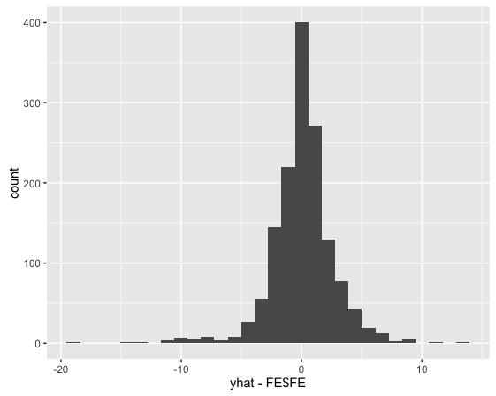

## Reading:
- **APM** Chapter 8.6 and 8.8 
- **APM** Chapter 14.8 
- **APM** Chapter 7.1 & 7.3 "Non-Linear Regression Models"
- **APM** Chapter 13.2 & 13.4 "Non-Linear Classifcation Models"


```{r,echo=FALSE}

packs <-  c('AppliedPredictiveModeling', 'ggplot2', 'magrittr', 'dplyr')

for( nm in packs ) { 
  # message(nm)
  if( ! nm  %in% installed.packages()[,1]  ) install.packages(nm)
  library(nm, character.only = TRUE)
}

# Load data set into environment
data(FuelEconomy)
.. = NULL  # Needed for aesthetics 

FE <- dplyr::bind_rows(cars2010, cars2011, cars2012)    # Define Da

```

## Fuel Economy 


This week we return to the Fuel Economy Data having learned much about model building. This assignment is to go through the process of building several regression models and pick the most predictive model. Use the `FE` data set created for you above.


Start by making choosing a metric and making a naive guess of model performance: 

Metric: root mean squared error (RMSE)
Naive Guess: the mean of the fuel economy (35.04)
Expected Model Performance (based on Naive Guess): The standard deviation of the fuel economy data about its mean is 8.10.  This is the full variance of the fuel economy without appealing to any of the dependent variables, such as `EngDispl` or `NumCyl`, to build a predictive model.

Show your work below for the calculations

```{r} 
rmse <- function(y,yhat) {
  ( y - yhat )^2  %>% mean   %>% sqrt 
}

naive_guess = mean(FE$FE)

err_naive_guess = rmse(FE$FE,naive_guess)

```


Based only your intuition, how low do your think you can get your metric: In homework 2 we already found that we could explain about half of this variance (i.e. RMSE~4-5) with a linear model.  A reasonable goal would be in the RMSE between 3 to 4 range.

## Examine your data

 * Plot your response/outcome.
 * Make a guess of a strong predictor: we know from homework 2 that `EngDispl` is a strong predictor. * Plot your response vs your predictor. 

```{r}
qplot(FE$FE)
qplot(y=FE$FE,x=FE$EngDispl)+geom_hline(yintercept=naive_guess,color="red")
```


## Build Simple Models

Using **caret**, build a simple linear model and a simple tree model. 

```{r}
ctrl=trainControl()
fit.lm <- train( FE ~ . , data=FE, trControl=ctrl, method="lm")
fit.rp <- train( FE ~ . , data=FE, trControl=ctrl, method="rpart")


fit.rp_cp <- train( FE ~ . , data=FE, trControl=ctrl, method="rpart",tuneGrid=expand.grid(cp=c(1e-3,1e-2,1e-1)))

fit.rp_md <- train( FE ~ . , data=FE, trControl=ctrl, method="rpart2",tuneGrid=expand.grid(maxdepth=c(2,4,6)))

```


What did you learn about the data from these models.

For the linear model, the RMSE is 3.62 and Rsquared is 0.80.  Examining the fit summary, the variables with the highest t-value are EngDispl, NumCyl, and DriveDescTwoWheelDriveFront.

For the simple rpart tree without setting a tuning grid by hand, three values of the complexity parameter were considered: 
```
 cp          RMSE      Rsquared 
  0.06355975  4.762431  0.6500988
  0.13451886  5.292054  0.5655529
  0.49666640  6.802672  0.4804395
```
The final model was the one with `cp=0.06`,`RMSE=4.76`, and `R-squared = 0.65`.  These results are not as good as the linear model, and in fact only `EnglDispl` was used in a tree of depth 2.  I tried scanning cp, and the best result was with `cp=0.001`,`RMSE=3.54`, and `R-squared = 0.81`.  However, this tree had a depth of 8 and was very complex.  Finally I scanned a few values of relatively small maxdepths.  The best result was with `maxdepth=6`,`RMSE=4.19`, and `R-squared = 0.74`.  This is the resulting tree:


## Build More Advanced Models

Now refine your models. Use **caret** to build advanced models:
- one that uses model averaging (bagging) 
- one that uses boosting 

```{r}

# Bagged conditional forests
bagCtrl<-cforest_control(mtry=ncol(FE)-1)
fit.bag<-cforest(FE ~ .,data=FE,controls=bagCtrl)
yhat<-predict(cforest(FE ~ .,data=FE,controls=bagCtrl))
rmse(FE$FE,yhat)
qplot(yhat-FE$FE)

# Gradient boosted model
fit.gbm <- train( FE ~ . , data=FE, trControl=ctrl, method="gbm")

gbmGrid <-  expand.grid(interaction.depth = c(1, 5, 9),
                        n.trees = (1:25)*10,
                        shrinkage = 0.1,
                        n.minobsinnode = 20)
fit.gbm_tune <- train( FE ~ . , data=FE, trControl=ctrl, method="gbm",tuneGrid=gbmGrid)

```

The residuals for the bagged conditional forest model:


## Conclusion 
```
Linear model:       RMSE = 3.62, Rsquared = 0.80
Best simple tree :  RMSE = 3.54, Rsquared = 0.81
Gradient boosted :  RMSE = 2.93, Rsquared = 0.87
Bagged cforest   :  RMSE = 2.60
```

I would choose the best performing models, such as stochastic gradient boosted trees, or bagged conditional inference trees, but only after trying out simpler models, such as the linear model, and gaining intuition for the baseline performance.  The complex models are not as easy to interpret, and often have a number of tuning parameters.  It is helpful to have a simple model reference point to make sure the complex models are yielding sensible results.


